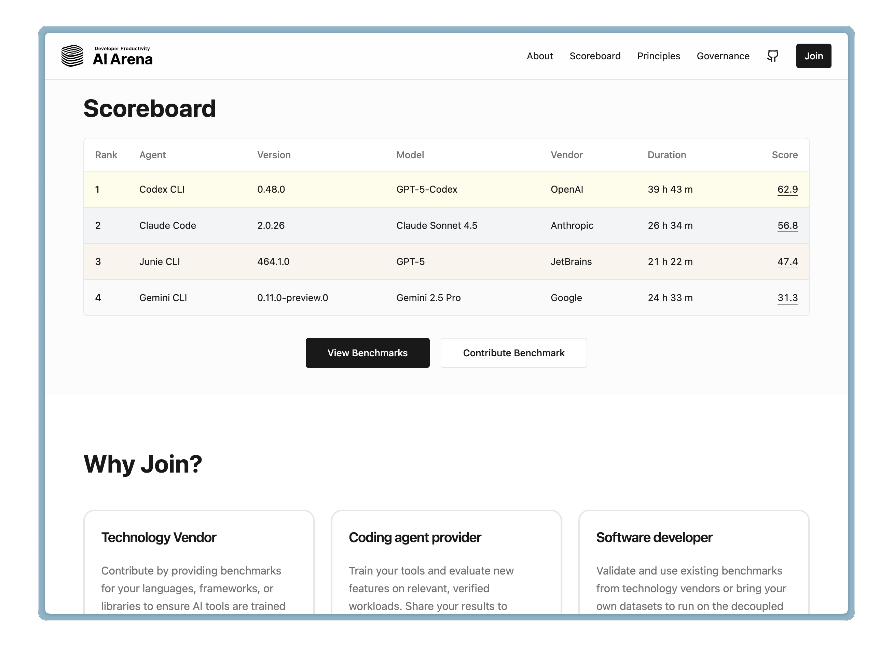

# Battle of the Bots 2.0: {.r-fit-text data-background="images/1.png"}
## AI Agents Unleashed, Winter 2026 Update
#### Calvin Hendryx-Parker, Six Feet Up CTO & AWS Hero
#### Travis Frisinger, 8th Light Head of Agentic AI

---

# The Contenders {data-background="images/3.png"}

- Claude Code
- Cursor
- Goose
- OpenAI Codex
- Google Antigravity

---

# What's New in Claude Code {.r-fit-text data-background="images/10.png"}

- **Models**: Sonnet 4.5 (default); Opus 4.1; Haiku 4.5
- **CLI/VS Code**: Native extension; smoother terminal; transcript shows model; `/export`
- **Commands**: `/rewind`; `/usage`; thinking toggle; Ctrl‑R history
- **Plugins/Skills**: Install/enable/marketplace; `/doctor`; Claude Skills
- **Bash/Sandbox**: Background commands; tab completion; BashTool sandbox (macOS/Linux)
- **Hooks/MCP**: Hooks events; @‑mentions; multi‑config; OAuth discovery

::: notes
- MCP support isn’t new (added in 2024); the recent changes are usability and enterprise enhancements
- Hooks docs: https://docs.claude.com/en/docs/claude-code/hooks
- Sources: Claude Code CHANGELOG and docs release notes
  - https://github.com/anthropics/claude-code/blob/main/CHANGELOG.md
  - https://docs.claude.com/en/release-notes/claude-code
:::

---

# What's New in Cursor {.r-fit-text data-background="images/1.png"}

- **Background Agents**: Continuous VMs; GitHub/IAM; dashboards
- **Modes**: Agent; Ask; Plan; Custom (reviewable plans)
- **Rules**: `.cursor/rules`; `AGENTS.md`; `/Generate Cursor Rules`
- **Headless/CI**: Headless CLI; GitHub Actions
- **MCP**: Client + Extension API; directory/install
- **Browser/Enterprise**: Built‑in browser; Admin API; Analytics; SSO/SCIM; spend controls

::: notes
- Background Agents: docs, API, webhooks — https://cursor.com/docs/background-agent | https://cursor.com/docs/background-agent/api/overview | https://cursor.com/docs/background-agent/api/webhooks
- Modes & Rules: https://cursor.com/docs/agent/modes | https://cursor.com/docs/context/rules
- Headless/CI & MCP: https://cursor.com/docs/cli/headless | https://cursor.com/docs/cli/github-actions | https://cursor.com/docs/context/mcp | https://cursor.com/docs/context/mcp-extension-api | https://cursor.com/docs/context/mcp/directory | https://cursor.com/docs/context/mcp/install-links
- Browser: https://cursor.com/docs/agent/browser
- Enterprise, Models & Changelog: https://cursor.com/docs/enterprise | https://cursor.com/docs/account/teams/admin-api | https://cursor.com/docs/account/teams/analytics-v2 | https://cursor.com/docs/enterprise/usage-and-spend-controls | https://cursor.com/docs/enterprise/model-and-integration-management | https://cursor.com/docs/account/teams/sso | https://cursor.com/docs/account/teams/scim | https://cursor.com/docs/context/max-mode | https://cursor.com/docs/models | https://www.cursor.com/changelog
:::

---

# What's New in Goose {.r-fit-text data-background="images/2.png"}

- **Recipes**: Repeatable workflows; cookbook generator
- **Subagents/Subrecipes**: Parallel delegation (experimental)
- **MCP‑UI**: Intent‑based UIs; auto visualizer (early)
- **Containers**: Isolated envs via Dagger/container MCP
- **Multi‑model**: Lead/Worker orchestration; per‑task routing
- **Providers/ACP**: OpenRouter; Tetrate Agent Router; ACP editor integration

::: notes
- Multi‑model (Lead/Worker): https://block.github.io/goose/docs/tutorials/lead-worker | https://block.github.io/goose/blog/2025/06/16/multi-model-in-goose
- Recipes + Containers: https://block.github.io/goose/blog/2025/05/06/recipe-for-success | https://block.github.io/goose/blog/2025/06/19/isolated-development-environments
- Subagents/Subrecipes (experimental) + MCP‑UI: https://block.github.io/goose/blog/2025/09/26/subagents-vs-subrecipes | https://block.github.io/goose/blog/2025/09/15/subrecipes-in-goose | https://block.github.io/goose/blog/2025/08/27/autovisualiser-with-mcp-ui
- Providers (OpenRouter/Tetrate) + ACP: https://block.github.io/goose/blog/2025/07/29/openrouter-unlocks-workshops | https://block.github.io/goose/blog/2025/08/27/get-started-for-free-with-tetrate | https://block.github.io/goose/blog/2025/10/24/intro-to-agent-client-protocol-acp
:::

---

# What's New in Google Antigravity {.r-fit-text data-background="images/3.png"}

::: notes

:::

---

# What's New: OpenAI Codex {.r-fit-text data-background="images/7.png"}

- **CLI**: TUI agent; open‑source at openai/codex
- **Models**: GPT‑5‑Codex; `/model` or `--model`
- **Approvals**: Auto; Read Only; Full Access
- **Exec**: `codex exec "task..."` (non‑interactive)
- **Images**: `--image path/to/file.png`
- **Cloud/SDK**: Delegate to cloud; Agents SDK; MCP guide

---

# Tool Comparison {data-background="images/4.png"}

| Tool        | Open  | MCP   | Agentic   | Models Supported      |
|-------------|-------|-------|-----------|-----------------------|
| Claude Code | No    | Yes   | Full      | Claude Models         |
| Cursor      | No    | Yes   | Full      | GPT-5, Claude, Gemini |
| Goose       | Yes   | Yes   | Full      | Bring your own        |
| Codex       | Yes   | Yes   | Full      | GPT-5-Codex           |
| Anitgravity | ???   | Yes   | Full      |                       |

::: notes
Needs updated and maybe different cols
:::

---

# Agentic Coding Models {data-background="images/1.png"}

---

# Developer Productivity AI Arena {.r-fit-text data-background="images/2.png"}

::: notes
- Launched Oct 28th 2025 (yesterday!)
- https://dpaia.dev/
- https://github.com/dpaia
:::

---

# Key Takeaways {.r-fit-text data-background="images/3.png"}

- No single assistant is best for every workflow
- MCP is enabling richer, more context-aware coding
- Open source tools are catching up fast
- Try several and see what fits your style!

---

# Talk To Us  {.r-fit-text data-background="images/1.png"}

📩 <calvin@sixfeetup.com>  
📩 <tfrisinger@8thlight.com>  
🤝 <https://linkedin.com/in/calvinhp>  
🤝 <https://www.linkedin.com/in/travis-frisinger>  

